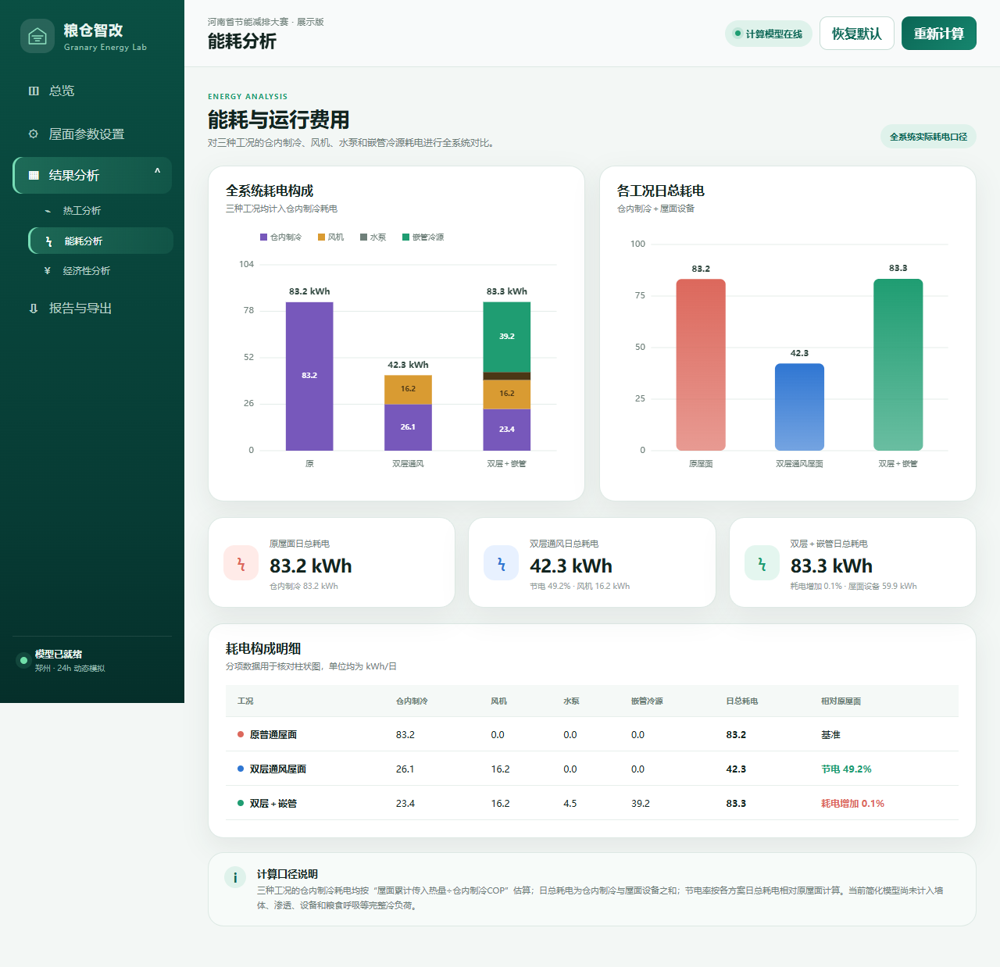

# 粮仓智改 Web/PWA 展示版（气温相位与全系统能耗修正版）

这是从 Python 桌面版独立迁移出的响应式网页版本，并结合老师修改意见、`粮仓智改14.py` 的耗电分解思路和 `粮仓智改15.py` 的室外气温相位修正完成更新。原 Python 文件没有被覆盖。

## 界面预览




## 直接使用

### 电脑快速打开

直接访问正式 HTTPS 地址即可。也可以双击 `index.html` 查看主要功能；但浏览器的“安装应用”和离线缓存功能需要通过本地网页服务或正式 HTTPS 链接访问。

### 手机打开

正式地址：<https://sascha-teng.github.io/granary-energy-app/>。手机浏览器可直接打开，并选择“添加到主屏幕”。

## 当前功能

- 响应式电脑/手机布局与“结果分析”分级导航；
- 屋面、运行控制和经济性参数输入与校验；
- 24小时三工况动态计算；
- 室外气温、仓顶温度、传入热量及全系统耗电图表；
- 三种工况的仓内制冷、风机、水泵和嵌管冷源分项明细；
- 全系统节电率、运行费用、经济性和回收期；
- CSV、TXT、JSON 导出及浏览器打印；
- PWA 安装和离线缓存。

## 本次模型修正

- 室外气温采用最低温3:00、最高温15:00的24小时简化曲线，修正原公式最高温出现在9:00的相位错误；
- 三种工况的仓内制冷耗电均按“屋面累计传入热量÷仓内制冷COP”估算；
- 日总耗电统一为“仓内制冷耗电＋屋面设备耗电”；
- 节电量和节电率统一由各方案日总耗电相对原屋面计算，不再混用热量与电量；
- 默认参数下，双层通风节电率约49.2%，双层＋嵌管耗电增加约0.1%；
- 经济性继续按照全系统日运行费用计算。

模型仍属于比赛展示用简化模型；仓内制冷负荷尚未计入墙体、渗透、设备和粮食呼吸等全部热源。

## 文件结构

```text
index.html              主页面
styles.css              响应式商业化界面
model.js                修正后的浏览器计算核心
app.js                  页面交互、图表与导出
manifest.webmanifest    PWA应用信息
service-worker.js       离线缓存
icons/                  应用图标
```

